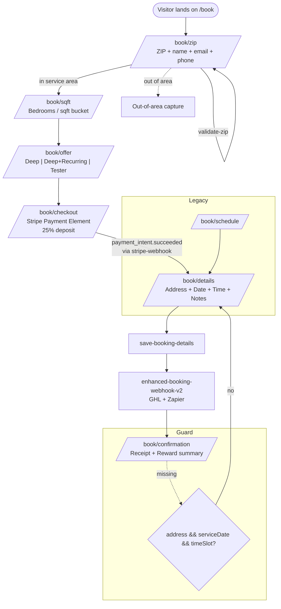

# Selestial Booking Hub

> Canonical reference for the AlphaLuxClean-style booking funnel as it will be
> reverse-engineered into Selestial — a multi-tenant, customer-customizable
> version of the same flow. Read this end-to-end before touching booking code.

## How to use this document

This Hub is the spec a Selestial engineer (or another AI agent) reads before
building or modifying the booking flow. It documents:

- **What AlphaLuxClean's flow does** (logical layer + visual layout) — the
  reference implementation you are replicating.
- **How that maps to Selestial** — what already exists in this repo
  (`src/app/book/[businessId]`, `src/app/embed/[businessId]/book`,
  `src/components/booking/*`, `src/app/api/booking/[businessId]/**`) and
  what still needs to be built.
- **What customers can customize** — every knob that turns this from a
  "single-store" booking page into a multi-tenant SaaS feature.

### Source-of-truth note

The AlphaLuxClean repository is private and not accessible from this agent's
GitHub permissions. The flow described below is the canonical funnel the
Selestial product owner (Malik) has documented for replication, plus what
already exists in `selestialapp` (the Aceternity / cleaning / responsive
booking widget components, the `/book/[businessId]` route, and the
`/api/booking/[businessId]/**` endpoints).

When porting a behavior, **verify against AlphaLuxClean's live source** before
shipping. Anywhere this doc says "TODO confirm" is a place where the
reference repo should be the tiebreaker.

---

## 1. Flow Overview — the 6-step funnel

```text
/book/zip           → ZIP validation + lead capture (name, email, phone)
/book/sqft          → Home size selection (bedrooms / sqft buckets)
/book/offer         → Offer cards: Deep Clean, Deep + Recurring, Tester
/book/checkout      → Stripe Payment Element (25% deposit)
/book/details       → Address + preferred date/time + notes (post-payment)
/book/confirmation  → Receipt + reward summary + next steps
```

### Routing rules and guards

- `/book/schedule` is a legacy alias that **redirects to `/book/details`**.
- A routing guard on `/book/confirmation` bounces the user back to
  `/book/details` if `address` or `serviceDate` / `timeSlot` are missing
  from `BookingContext`. This prevents users from landing on a "thank you"
  page with no scheduled job.
- Each step writes to `localStorage` so a refresh recovers the flow.
- Each transition fires a `partial_bookings` upsert so abandoned funnels can
  be reconstructed for re-engagement campaigns.

### Mermaid: full funnel

See [`docs/selestial-booking-flow.mmd`](./selestial-booking-flow.mmd) for the
diagram source. Inline render:



### Where each step lives in `selestialapp` today

| Funnel step      | Existing file in this repo                                              | Status                |
| ---------------- | ----------------------------------------------------------------------- | --------------------- |
| Marketing entry  | `src/app/welcome/page.tsx` (Pricing Wizard demo)                        | Done                  |
| ZIP gate         | `src/components/booking/cleaning-booking-widget.tsx` (ZIP step)         | Inline, not a route   |
| Home size        | same component (size step)                                              | Inline                |
| Offer            | same component (services step)                                          | Inline                |
| Checkout         | `/api/booking/[businessId]/book/route.ts` + Stripe edge func (TODO)     | Partial               |
| Details          | same component (schedule step)                                          | Inline                |
| Confirmation     | same component (success step)                                           | Inline                |
| Public page      | `src/app/book/[businessId]/page.tsx`                                    | Done                  |
| Embed page       | `src/app/embed/[businessId]/book/page.tsx`                              | Done                  |

The current Selestial widgets render the entire flow as **steps inside a
single component** (`cleaning-booking-widget.tsx` and friends). The
AlphaLuxClean reference uses **dedicated routes per step**. Either pattern is
valid; the route-per-step pattern is preferred for SEO + analytics +
deep-linking and is what we will adopt for the v2 Selestial flow.

---

## 2. State management — `BookingContext`

A single React context owns the whole funnel. State persists to
`localStorage` so refresh, back/forward, and tab restore all work.

### `BookingData` shape

```ts
type Channel = 'sms' | 'email' | 'both';

export interface BookingData {
  // Tenant
  businessId: string;            // multi-tenant key (Selestial addition)

  // Step 1 — ZIP + lead
  zip: string | null;
  city: string | null;
  state: string | null;          // 2-letter, drives state multiplier
  outOfArea: boolean;
  contact: {
    firstName: string;
    lastName: string;
    email: string;
    phone: string;               // E.164 normalized
    smsOptIn: boolean;
    preferredChannel: Channel;
  };

  // Step 2 — Home size
  homeSizeId: string | null;     // matches a HOME_SIZE_RANGES.id
  bedrooms: number | null;
  bathrooms: number | null;

  // Step 3 — Offer
  offerType: 'deep' | 'deep_recurring' | 'tester' | null;
  recurringFrequency: 'weekly' | 'biweekly' | 'monthly' | null;

  // Pricing snapshot (recomputed on every relevant change)
  basePrice: number;             // dollars, server-confirmed before checkout
  addons: { id: string; name: string; price: number }[];
  promoCode: string | null;
  discountAmount: number;
  total: number;
  depositAmount: number;         // = round(total * 0.25)
  balanceDue: number;            // = total - depositAmount

  // Step 4 — Checkout
  stripeClientSecret: string | null;
  stripePaymentIntentId: string | null;
  paid: boolean;
  paidAt: string | null;         // ISO

  // Step 5 — Details
  address: {
    line1: string;
    line2: string | null;
    city: string;
    state: string;
    zip: string;
    accessNotes: string | null;
  } | null;
  serviceDate: string | null;    // YYYY-MM-DD
  timeSlot: string | null;       // 'morning' | 'midday' | 'afternoon' | 'HH:mm'
  customerNotes: string | null;

  // Step 6 — Confirmation
  bookingId: string | null;      // server-issued UUID
  rewardSummary: {
    rewardCents: number;         // referral / welcome reward
    code: string | null;
  } | null;

  // Metadata
  createdAt: string;
  updatedAt: string;
  utm: { source: string | null; medium: string | null; campaign: string | null };
}
```

### Persistence

- localStorage key: **`alphalux-booking-flow`** (kept for parity; Selestial
  multi-tenant version namespaces as `selestial-booking-flow:{businessId}`)
- Hydrated on first mount; serialized on every state change (debounced 250ms).
- TTL: 24 hours from `createdAt`. Stale flows are wiped on hydrate.
- Cleared on confirmation success **and** on explicit "start over" CTA.

### Recalc rules

`basePrice`, `discountAmount`, `total`, `depositAmount`, and `balanceDue`
recompute whenever any of these change:

- `homeSizeId`, `state`, `offerType`, `recurringFrequency`, `addons[]`,
  `promoCode`.

Skip the recalc when:

- `offerType` is set **and** the user is past the `/book/checkout` step —
  the price is locked once the Payment Intent is created. Server is the
  source of truth from that point forward.

---

## 3. Pricing logic

### Home size buckets — `HOME_SIZE_RANGES`

```ts
export const HOME_SIZE_RANGES = [
  { id: 'small',    label: 'Up to 1,500 sqft',     bedrooms: '1-2', basePrice: 145 },
  { id: 'medium',   label: '1,500 – 2,500 sqft',   bedrooms: '3',   basePrice: 195 },
  { id: 'large',    label: '2,500 – 3,500 sqft',   bedrooms: '4',   basePrice: 265 },
  { id: 'xlarge',   label: '3,500 – 5,000 sqft',   bedrooms: '5',   basePrice: 345 },
  { id: 'estate',   label: '5,000+ sqft',          bedrooms: '6+',  basePrice: 445 },
] as const;
```

> Numbers are placeholders matching the welcome-page Pricing Wizard. The live
> AlphaLuxClean values should be confirmed and overridden per-tenant in
> `cleaning_pricing_config` (already wired on the backend).

### State multipliers

```ts
export const STATE_MULTIPLIERS: Record<string, number> = {
  TX: 1.20,  // Texas — primary AlphaLuxClean market
  CA: 1.10,  // California
  NY: 1.15,  // New York
  // ...default 1.00
};
```

`finalBase = HOME_SIZE_RANGES[homeSizeId].basePrice * (STATE_MULTIPLIERS[state] ?? 1)`

### Offer types and recurring discount tiers

| Offer            | Description                                     | Discount on base |
| ---------------- | ----------------------------------------------- | ---------------- |
| `deep`           | One-time deep clean                             | 0%               |
| `deep_recurring` | Deep clean + first recurring service            | 15% / 10% / 5%   |
| `tester`         | $99 starter clean (single-room or studio)       | flat $99         |

`deep_recurring` discount tiers:
- **Weekly** — 15% off recurring + initial deep
- **Biweekly** — 10% off recurring + initial deep
- **Monthly** — 5% off recurring + initial deep

### Promotions

- `WELCOME2025` — $25 off `deep`, **OR** an additional 10% off `deep_recurring`
  (cannot stack with `tester`).
- Promo is applied client-side for UX speed and **re-validated server-side**
  in `create-payment-intent` before the deposit charge.

### Deposit / balance split

```ts
depositAmount = Math.round(total * 0.25 * 100) / 100;   // 25% deposit
balanceDue    = total - depositAmount;                  // 75% on completion
```

Selestial extension: deposit % is per-tenant in
`businesses.deposit_percent` (already in the schema). Default 25.

---

## 4. Visual layout — per page

All pages share a common chrome: top progress bar + sidebar summary card +
main content. On mobile (`< 768px`) the sidebar collapses to a sticky bottom
sheet.

### Common chrome

- **`<BookingProgressBar />`** — 6 dots / labels showing current step.
  Phone number `972-559-0223` rendered top-right (per-tenant override comes
  from `businesses.phone` in Selestial).
- **`<SummaryCard />`** sidebar — shows selected size, offer, addons,
  promo, total. Sticky on desktop.
- **Trust strip** — Google Guaranteed badge, 4.9★ reviews widget, BBB A+,
  insured. Each is a per-tenant flag in `booking_widget_configs`.
- **Showcase carousel** — before/after photos. Per-tenant uploadable.

### `/book/zip` — ZIP + lead capture

```
┌──────────────────────────────────────────────────────────────┐
│  [logo]            [progress: ●○○○○○]              📞 phone   │
├──────────────────────────────────────────────────────────────┤
│                                                              │
│   Stop wasting Saturdays cleaning.                           │
│   Get a sparkling home — booked in 60 seconds.               │
│                                                              │
│   ┌────────────────────┐    ┌──────────────────────────────┐ │
│   │ ZIP CODE  [_____]  │    │ Trust strip                  │ │
│   │ First    [_______] │    │  ★ 4.9 (412 reviews)         │ │
│   │ Last     [_______] │    │  ✔ Google Guaranteed         │ │
│   │ Email    [_______] │    │  ✔ Bonded & insured           │ │
│   │ Phone    [_______] │    └──────────────────────────────┘ │
│   │ ☑ Text me updates  │                                    │
│   │ [ Continue → ]     │    [ before/after carousel ]       │
│   └────────────────────┘                                    │
└──────────────────────────────────────────────────────────────┘
```

Behavior:
- Inline ZIP validation hits `validate-zip` (debounced 400ms).
- Out-of-area returns `outOfArea: true`, swaps the form for a
  capture-to-waitlist CTA, and writes a `partial_bookings` row tagged `oos`.
- Phone field is auto-formatted to E.164 client-side.
- `emit-lead-webhook` fires on first valid (zip + email) — even before the
  user clicks Continue. This is the speed-to-lead trigger.

### `/book/sqft` — home size selection

5 cards (matching `HOME_SIZE_RANGES`). Each card shows:

- Bedroom range (1-2, 3, 4, 5, 6+)
- Sqft bucket
- "Most popular" badge on `medium`
- Live price from `STATE_MULTIPLIERS` based on the user's state.

Mobile: 2-up grid. Desktop: 5-up.

### `/book/offer` — offer cards

3 large cards side-by-side (desktop) / stacked (mobile):

1. **Deep Clean** — one-time, full breakdown of what's included.
2. **Deep + Recurring** — most prominent (gradient border, "Best Value"
   badge). Frequency selector (weekly / biweekly / monthly) reveals the
   matching discount tier.
3. **Tester $99** — flat-rate starter, only enabled for `small` home sizes.

The summary card on the right shows the live `total`, `depositAmount`,
`balanceDue`, and any active promo line.

### `/book/checkout` — Stripe Payment Element

```
┌──────────────────────────────────────────────────────────────┐
│  Secure your booking with a 25% deposit                       │
│                                                              │
│   ┌──────────────────────┐   ┌──────────────────────────────┐ │
│   │ Stripe Payment       │   │ Order summary                │ │
│   │  Element             │   │   Deep + Recurring (3BR)     │ │
│   │  • Card / Apple Pay  │   │   $245.00                    │ │
│   │  • Link              │   │   Add-ons: oven, fridge      │ │
│   │  • Cash App          │   │   $70.00                     │ │
│   │                      │   │   Promo WELCOME2025 -$25.00  │ │
│   │ [ Pay $72.50 ]       │   │   Total: $290.00             │ │
│   └──────────────────────┘   │   Deposit (25%): $72.50      │ │
│                              │   Balance due: $217.50       │ │
│                              └──────────────────────────────┘ │
│   🔒 Powered by Stripe • PCI compliant                        │
└──────────────────────────────────────────────────────────────┘
```

- `clientSecret` returned from `create-payment-intent` is mounted into the
  Stripe Elements provider.
- On success, the page does NOT navigate yet — it waits for the
  `confirm-booking-payment` callback to write `paid: true`, then routes to
  `/book/details`.
- `stripe-webhook` is the **authoritative** confirmation path; the
  client-side path is optimistic. Race conditions are resolved server-side
  using `payment_intent.id` as the idempotency key.

### `/book/details` — address + scheduling

- Address autocomplete (Google Places). Validated against the booked ZIP.
- Date picker driven by `get-available-slots` (closed calendar — see §7).
- Time slot picker shows live remaining capacity per slot.
- Notes textarea (parking, pets, key, alarm code, etc.).

### `/book/confirmation` — receipt

- Big green check, booking ID, summary, deposit receipt link, calendar
  invite (`.ics`), referral reward CTA, "what to expect" timeline.
- Fires `enhanced-booking-webhook-v2` if not already fired.

### Mobile vs. desktop

Tailwind breakpoints used throughout the existing widgets:

| Breakpoint      | Behavior                                        |
| --------------- | ----------------------------------------------- |
| `< sm` (640px)  | Single column, sticky bottom summary sheet      |
| `sm` – `lg`     | 2 column on offer/sqft, sidebar still bottom    |
| `≥ lg` (1024px) | Full 2-column layout with sticky right sidebar  |

---

## 5. Backend architecture — edge functions

The funnel is powered by a chain of Supabase Edge Functions. Each is a
single responsibility and idempotent on its primary key.

```text
validate-zip                → city/state lookup + service-area gate
emit-lead-webhook           → fires GHL / Zapier as soon as ZIP+email valid
create-payment-intent       → upserts customer + creates booking row +
                              creates Stripe PaymentIntent, returns
                              clientSecret
stripe-webhook              → on payment_intent.succeeded:
                                - flips bookings.payment_status='paid_deposit'
                                - decrements availability_schedule.booked_slots
                                - fires enhanced-booking-webhook-v2
confirm-booking-payment     → optimistic client confirmation; safe no-op if
                              the webhook already ran
save-booking-details        → writes address + date + time_slot to bookings
                              after payment
send-balance-invoice        → 75% balance invoice via Stripe Invoices,
                              triggered on job_completed
enhanced-booking-webhook-v2 → unified GHL + Zapier sync (replaces v1)
```

### I/O contracts

```ts
// validate-zip
POST { zip: string, businessId: string }
→ 200 { city, state, inServiceArea, multiplier }
→ 422 { error: 'invalid_zip' }

// emit-lead-webhook
POST { businessId, zip, email, firstName, lastName, phone, utm }
→ 202 { leadId }   // fire-and-forget

// create-payment-intent
POST { businessId, bookingDraft: BookingData }
→ 200 { clientSecret, paymentIntentId, bookingId, total, deposit }
→ 422 { error: 'price_changed', newTotal, newDeposit }   // server recalc'd

// stripe-webhook  (Stripe → us)
POST stripe events; verifies signature; routes by event.type

// confirm-booking-payment
POST { paymentIntentId }
→ 200 { booking, alreadyConfirmed: boolean }

// save-booking-details
POST { bookingId, address, serviceDate, timeSlot, notes }
→ 200 { booking }

// send-balance-invoice
POST { bookingId }
→ 200 { invoiceId, hostedInvoiceUrl }

// enhanced-booking-webhook-v2
POST { bookingId }
→ 202 { ghlContactId, ghlOpportunityId, zapierTriggered }
```

### Mapping to Selestial today

The repo currently exposes the same surface area as **Next.js route
handlers** under `src/app/api/booking/[businessId]/**`:

| Edge function name              | Selestial route                                                     |
| ------------------------------- | ------------------------------------------------------------------- |
| `validate-zip`                  | _to add_ — currently inlined in widget                              |
| `emit-lead-webhook`             | _to add_                                                            |
| `create-payment-intent`         | `src/app/api/booking/[businessId]/book/route.ts` (extend)           |
| `stripe-webhook`                | Existing Supabase edge fn `stripe-webhook` + Next route             |
| `confirm-booking-payment`       | _to add_                                                            |
| `save-booking-details`          | _to add_                                                            |
| `send-balance-invoice`          | _to add_                                                            |
| `enhanced-booking-webhook-v2`   | _to add_ (will use the new GHL client at `src/lib/integrations/ghl/`) |

Per-tenant pricing already lives in
`src/app/api/booking/[businessId]/pricing/{config,addons,multipliers,calculate}/route.ts`.
Calculate is the single source of truth for `total` / `deposit` / `balance`.

---

## 6. Database schema — the 4 tables that matter

These are the tables that drive a booking. All are tenant-scoped via
`business_id` and protected by the tenant-isolation RLS policies added in
`supabase/migrations/20260418_selestial_live_alignment.sql`.

### 6.1 `customers`

Already exists in the live schema. Relevant columns:

```text
id, business_id, name, email, phone, address,
customer_type, tags, first_service_at, last_service_at, next_service_at,
total_jobs, total_spent, average_job_value,
is_recurring, recurring_frequency, recurring_service_type, recurring_amount,
health_score, marketing_opted_out, ...
```

Booking flow writes:
- ZIP step → upsert by `(business_id, email)` with name + phone.
- Confirmation step → set `address`, increment `total_jobs`, set
  `is_recurring`, `recurring_frequency`, `recurring_amount` if
  `offerType === 'deep_recurring'`.

### 6.2 `bookings` (NEW — to add)

```sql
CREATE TABLE public.bookings (
  id              uuid PRIMARY KEY DEFAULT gen_random_uuid(),
  business_id     uuid NOT NULL REFERENCES public.businesses(id) ON DELETE CASCADE,
  customer_id     uuid REFERENCES public.customers(id),

  -- Funnel snapshot
  zip             text NOT NULL,
  city            text,
  state           text,
  home_size_id    text,
  bedrooms        int,
  bathrooms       int,
  offer_type      text NOT NULL CHECK (offer_type IN ('deep','deep_recurring','tester')),
  recurring_frequency text CHECK (recurring_frequency IN ('weekly','biweekly','monthly')),
  addons          jsonb NOT NULL DEFAULT '[]'::jsonb,
  promo_code      text,

  -- Money (cents)
  base_price_cents     int NOT NULL,
  discount_cents       int NOT NULL DEFAULT 0,
  total_cents          int NOT NULL,
  deposit_cents        int NOT NULL,
  balance_due_cents    int NOT NULL,

  -- Stripe
  stripe_payment_intent_id text UNIQUE,
  stripe_invoice_id        text,
  payment_status   text NOT NULL DEFAULT 'pending'
    CHECK (payment_status IN ('pending','paid_deposit','paid_full','refunded','failed')),

  -- Schedule
  service_date     date,
  time_slot        text,
  address          jsonb,
  customer_notes   text,

  -- Lifecycle
  status text NOT NULL DEFAULT 'draft'
    CHECK (status IN ('draft','awaiting_payment','confirmed','scheduled','completed','canceled','no_show')),
  confirmed_at     timestamptz,
  completed_at     timestamptz,
  canceled_at      timestamptz,

  -- Metadata
  utm              jsonb,
  created_at       timestamptz NOT NULL DEFAULT now(),
  updated_at       timestamptz NOT NULL DEFAULT now()
);

CREATE INDEX bookings_business_status_idx ON public.bookings (business_id, status);
CREATE INDEX bookings_service_date_idx    ON public.bookings (business_id, service_date);
ALTER TABLE public.bookings ENABLE ROW LEVEL SECURITY;
CREATE POLICY "bookings tenant all" ON public.bookings
  FOR ALL USING (public.is_business_owner(business_id))
         WITH CHECK (public.is_business_owner(business_id));
```

### 6.3 `partial_bookings` (NEW — to add)

```sql
CREATE TABLE public.partial_bookings (
  id          uuid PRIMARY KEY DEFAULT gen_random_uuid(),
  business_id uuid NOT NULL REFERENCES public.businesses(id) ON DELETE CASCADE,
  email       text,
  phone       text,
  zip         text,
  step        text NOT NULL,             -- 'zip' | 'sqft' | 'offer' | 'checkout' | 'details'
  payload     jsonb NOT NULL DEFAULT '{}'::jsonb,
  utm         jsonb,
  last_seen_at timestamptz NOT NULL DEFAULT now(),
  created_at  timestamptz NOT NULL DEFAULT now(),
  UNIQUE (business_id, COALESCE(email, ''), COALESCE(phone, ''))
);

ALTER TABLE public.partial_bookings ENABLE ROW LEVEL SECURITY;
CREATE POLICY "partial_bookings tenant all" ON public.partial_bookings
  FOR ALL USING (public.is_business_owner(business_id))
         WITH CHECK (public.is_business_owner(business_id));
```

This is what powers re-engagement of abandoned funnels — the speed-to-lead
SMS sequence reads from here at `step IN ('zip','sqft','offer','checkout')`.

### 6.4 `availability_schedule` (NEW — to add)

The closed-calendar table. See §7 for the full pattern.

```sql
CREATE TABLE public.availability_schedule (
  id              uuid PRIMARY KEY DEFAULT gen_random_uuid(),
  business_id     uuid NOT NULL REFERENCES public.businesses(id) ON DELETE CASCADE,
  date            date NOT NULL,
  time_slot       text NOT NULL,         -- 'morning' | 'midday' | 'afternoon' | 'HH:mm'
  zip_code        text,                  -- optional zone scoping
  available_slots int  NOT NULL,         -- capacity
  booked_slots    int  NOT NULL DEFAULT 0,
  is_blackout     boolean NOT NULL DEFAULT false,
  notes           text,
  created_at      timestamptz NOT NULL DEFAULT now(),
  updated_at      timestamptz NOT NULL DEFAULT now(),
  UNIQUE (business_id, date, time_slot, COALESCE(zip_code, ''))
);

CREATE INDEX availability_schedule_lookup_idx
  ON public.availability_schedule (business_id, date, time_slot);

ALTER TABLE public.availability_schedule ENABLE ROW LEVEL SECURITY;

-- Owner full access
CREATE POLICY "availability_schedule tenant all" ON public.availability_schedule
  FOR ALL USING (public.is_business_owner(business_id))
         WITH CHECK (public.is_business_owner(business_id));

-- PUBLIC read of remaining capacity for the embeddable widget.
-- Exposes only future, non-blackout, non-full slots.
CREATE POLICY "availability_schedule public read" ON public.availability_schedule
  FOR SELECT
  TO anon
  USING (
    NOT is_blackout
    AND date >= CURRENT_DATE
    AND booked_slots < available_slots
  );
```

---

## 7. Closed Calendar System — the Selestial-relevant piece

The "closed calendar" is the contract that the booking widget can only show
times that the business has explicitly opened. No external calendar
integration is required for v1; the source of truth is
`availability_schedule`.

### Slot model

- A row = `(business_id, date, time_slot)` with capacity.
- `time_slot` can be a band (`morning` / `midday` / `afternoon`) or a clock
  time (`09:00`, `13:30`). The widget picks the format based on the
  tenant's `business_hours_*` settings on `businesses`.
- `available_slots` is set by the owner. `booked_slots` is incremented when
  a booking transitions to `confirmed`.
- `is_blackout=true` always returns the slot as unavailable, regardless of
  capacity (used for holidays, owner days off).

### Edge functions

```text
get-available-slots       → public; returns the next N days × time_slots
                            with remaining capacity
get-live-availability     → same but with cache-bust headers; called by
                            the widget every 30s while the time picker is
                            open
check-calendar-availability → server-side guard called from
                            create-payment-intent to refuse a booking if
                            capacity dropped to 0 between picker and pay
```

### Decrement / restore lifecycle

```text
draft               → no slot reserved
awaiting_payment    → soft hold (TTL 15 min via Redis or PG advisory lock)
confirmed           → booked_slots += 1   (atomic UPDATE ... WHERE booked < avail)
canceled / refunded → booked_slots -= 1
```

Atomic decrement (run inside `stripe-webhook`):

```sql
UPDATE public.availability_schedule
   SET booked_slots = booked_slots + 1,
       updated_at   = now()
 WHERE business_id  = $1
   AND date         = $2
   AND time_slot    = $3
   AND COALESCE(zip_code, '') = COALESCE($4, '')
   AND booked_slots < available_slots
   AND is_blackout = false
RETURNING id;
```

If this returns 0 rows after the deposit was charged, run the
`overbooking_recovery` flow: refund deposit, email customer, surface in
admin alert. **Never silently double-book.**

### Public read API (for embed)

`GET /api/booking/[businessId]/availability?from=YYYY-MM-DD&days=14&zip=XXXXX`
→ already exists in this repo at
`src/app/api/booking/[businessId]/availability/route.ts`. Wire it to read
from `availability_schedule` once that table is created.

---

## 8. Embed Component Blueprint

The booking flow ships in three forms:

1. **Hosted page** — `https://selestial.app/book/{businessSlug}` (already
   exists at `src/app/book/[businessId]/page.tsx`).
2. **Embeddable iframe** — `https://selestial.app/embed/book/{businessSlug}`
   (extends existing `src/app/embed/[businessId]/book/page.tsx`).
3. **Drop-in JS SDK** — a single `<script>` tag that injects the iframe
   and handles auto-resize + callbacks via `postMessage`.

### Embed page conventions

- Renders **without** the marketing nav/footer. The existing embed route
  already does this — extend it to accept `?theme=light|dark` and
  `?primary=#hex`.
- Reads brand color from `businesses.company_color` at SSR time.
- Sends `postMessage` events to the parent on:
  - `selestial:height` → `{ height: number }` for auto-resize
  - `selestial:step`   → `{ step: string }` for parent analytics
  - `selestial:booking_completed` → `{ bookingId, total, depositAmount }`

### URL params

| Param        | Purpose                                                     |
| ------------ | ----------------------------------------------------------- |
| `zip`        | Pre-fill the ZIP step                                       |
| `homeSize`   | Pre-select size                                             |
| `offer`      | Pre-select offer card                                       |
| `promo`      | Auto-apply promo code                                       |
| `theme`      | `light` (default) / `dark`                                  |
| `primary`    | Override brand color, e.g. `%237c3aed`                      |
| `utm_source` | Persisted onto `bookings.utm`                               |
| `utm_medium` | Same                                                        |
| `utm_campaign` | Same                                                      |

### Snippet template

```html
<!-- The Selestial booking widget -->
<div data-selestial-book
     data-business-id="acme-cleaning"
     data-zip="77001"
     data-theme="light"
     data-primary="#7c3aed"></div>
<script src="https://selestial.app/embed.js" defer></script>
```

`embed.js` (to build) will:

1. Find every `[data-selestial-book]` on the page.
2. For each, build the iframe URL from the dataset.
3. Inject a responsive `<iframe>` with `loading="lazy"` and `min-height: 720`.
4. Listen for `selestial:height` postMessages and resize the iframe.
5. Re-emit `selestial:booking_completed` as a `CustomEvent` on the host
   element so embedders can hook with vanilla JS:

```js
document.querySelector('[data-selestial-book]')
  .addEventListener('selestial:booking_completed', (e) => {
    console.log('Booked!', e.detail.bookingId, e.detail.total);
  });
```

### Multi-tenant customization surface

Everything the customer (cleaning company owner) can customize lives in
two places:

| Surface                    | Storage                                                            |
| -------------------------- | ------------------------------------------------------------------ |
| Brand (logo, color, name)  | `businesses.company_logo_url`, `company_color`, `name`             |
| Phone / hours              | `businesses.phone`, `business_hours_*`, `business_days`            |
| Pricing & multipliers      | `cleaning_pricing_config`, `cleaning_service_multipliers`,         |
|                            | `cleaning_sqft_tiers`, `cleaning_addons`, `cleaning_frequency_*`   |
| Promotions                 | `booking_widget_configs.config.promotions[]`                       |
| Trust badges, photos       | `booking_widget_configs.config.trust`                              |
| Service area (ZIP list)    | `booking_widget_configs.config.serviceZips[]`                      |
| Deposit %                  | `businesses.deposit_percent` (default 25)                          |
| Available time slots       | `availability_schedule` (owner-managed)                            |
| Email/SMS on confirmation  | `businesses.send_quote_email`, `send_quote_sms`, etc.              |

The admin UIs for these already exist or are scaffolded:

- `src/components/admin/booking/branding-editor.tsx`
- `src/components/admin/booking/pricing-model-editor.tsx`
- `src/components/admin/booking/promotion-manager.tsx`
- `src/components/admin/booking/service-area-manager.tsx`
- `src/app/(dashboard)/bookings/customize/...`

---

## Implementation checklist (when porting to Selestial)

In the order an engineer should build this:

- [ ] Confirm AlphaLuxClean's exact route names, copy, and wireframes
      against this Hub. Patch the Hub before writing code if reality differs.
- [ ] Create `bookings`, `partial_bookings`, `availability_schedule` tables
      with the SQL in §6 (new migration file under
      `supabase/migrations/2026MMDD_booking_core.sql`).
- [ ] Split the existing single-component widgets into route-per-step pages
      under `src/app/book/[businessId]/(funnel)/{zip,sqft,offer,checkout,details,confirmation}/page.tsx`.
- [ ] Lift the funnel state into `src/contexts/BookingContext.tsx` with the
      `localStorage` persistence pattern from §2.
- [ ] Wire the existing `pricing/calculate` route as the single recalc
      source.
- [ ] Add the missing edge functions / route handlers from §5.
- [ ] Add the `availability_schedule` admin UI in
      `src/app/(dashboard)/bookings/customize/availability/page.tsx`.
- [ ] Build `embed.js` in `public/embed.js` with the postMessage protocol
      from §8.
- [ ] Add the `selestial:booking_completed` event to `enhanced-booking-webhook-v2`
      so it fires GHL via the existing `src/lib/integrations/ghl/client.ts`.
- [ ] Smoke-test the full funnel end-to-end on a test business.

---

## Glossary

- **AlphaLuxClean** — the reference cleaning operation whose booking flow
  Selestial is replicating.
- **Funnel** — the 6 routes from `/book/zip` to `/book/confirmation`.
- **Closed calendar** — capacity stored in `availability_schedule`,
  no external sync required for v1.
- **Embed** — iframe + JS SDK for installing the widget on a third-party
  site.
- **Tenant** — a Selestial customer (a cleaning company). Identified by
  `businesses.id` everywhere.
- **GHL** — GoHighLevel; the primary CRM Selestial syncs to via
  `src/lib/integrations/ghl/client.ts`.
